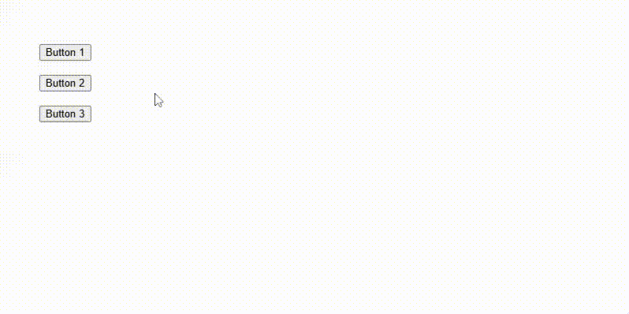

`:focus` dan `:focus-visible` sama-sama dapat digunakan untuk memberikan style pada elemen yang sedang dalam keadaan focus. Lalu apa bedanya?

Bedanya, `:focus-visible` hanya diberikan ketika elemen sedang focus dan **membutuhkan indikator focus**.

Karena tidak semua elemen yang sedang focus itu membutuhkan indikator focus, misalnya ketika focus terjadi karena klik mouse atau tap layar, maka tidak perlu membutuhkan indikator focus.

Indikator focus biasanya dibutuhkan ketika focus terjadi karena tab keyboard atau dari screen reader.

Contohnya pada `button`, umumnya ketika diklik dengan mouse tidak akan muncul outline. Tapi ketika ditab sampai ke button tersebut maka akan muncul outline. Karena focus dengan tab membutuhkan indikator focus.

Contoh:

```css
button:focus {
    outline: none;
}

button:focus-visible {
    outline: 2px solid black;
}
```

Hasilnya:


