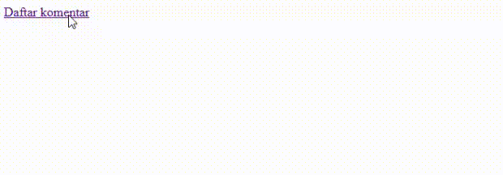
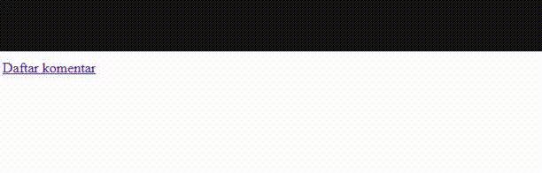
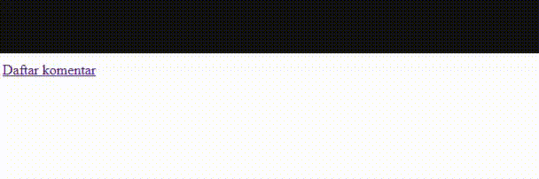

*Anchor link* atau *jump link* adalah link yang menuju ke suatu bagian di halaman website.

Alamat anchor link ditulis dengan `#id-tujuan` . Bagian yang dituju harus diberi atribut `id` yang berisi nama bagiannya. Contoh:

```html
<a href="#komentar">Daftar komentar</a>
<!-- -->
<section id="komentar">
	<!-- -->
</section>
```

Ketika link `Daftar komentar` diklik, maka halaman akan scroll ke section `komentar`.



## Mengatasi Scroll Tertutup Oleh Navbar yang Fixed

Jika di halaman ada navbar yang fixed, maka ketika scroll ke anchor link, bagian atas section tujuan akan tertutup oleh navbar.



Solusinya, tambahkan properti CSS `scroll-margin-top` ke section tujuan. Nilainya kira-kira sesuai tinggi navbar lebih sedikit.

```css
#komentar {
	scroll-margin-top: 1.25rem;
}
```

Hasilnya, ketika scroll anchor link, maka bagian tujuan akan terlihat sepenuhnya.



## Mengenal Properti CSS Scroll Margin

Scroll margin mudahnya adalah properti css untuk menambahkan jarak ke elemen ketika ada scroll otomatis ke elemen itu.

Jarak yang ditambahkan bisa di berbagai sisi seperti `top`, `left`, `right`, `bottom`, dll.

Baca selengkapnya tentang scroll margin di [scroll-margin CSS property - CSS | MDN](https://developer.mozilla.org/en-US/docs/Web/CSS/Reference/Properties/scroll-margin).