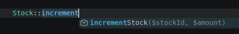

Laravel banyak menggunakan facade di fitur-fiturnya, seperti `Auth`, `Cache`, `Request` dll.

Apa itu facade? Bisakah kita membuat custom facade sendiri? Berikut penjelasannya.

## Apa itu Facade?

Facade adalah class yang menjadi jembatan dari class lain agar method di class lain bisa dipanggil lewat class facade seperti static method.

Contoh:

```php
use App\Services\StockService;
use App\Facades\Stock;

// Tanpa facade
public function updateStock() {
	$stockService = new StockService()
	$stockService->incrementStock(10, 1000);
	$stockService->decrementStock(15, 200);
}

// Tanpa facade
public function updateStock(StockService $stockService)
{
	$stockService->incrementStock(10, 1000);
	$stockService->decrementStock(15, 200);
}

// Dengan facade
public function updateStock()
{
	Stock::incrementStock(10, 1000);
	Stock::decrementStock(15, 200);
}
```

## Cara Membuat Facade Sendiri

Pertama, buat class yang ingin dibuat facade. Contoh `StockService`.

```bash
php artisan make:class Services/StockService
```

```php
<?php

namespace App\Services;

class StockService
{
    public function incrementStock(int $stockId, int $amount) {}
    public function decrementStock(int $stockId, int $amount) {}
}
```

Kemudian buat class facade untuk class `StockService` misalnya `Stock` .

```bash
php artisan make:class Facades/Stock
```

```php
<?php

namespace App\Facades;

class Stock {}
```

Aktifkan facade pada class facade dengan mengextend `Illuminate\Support\Facades\Facade`.

```php
<?php

namespace App\Facades;

use Illuminate\Support\Facades\Facade;

class Stock extends Facade {}
```

Buat static method `getFacadeAccessor` di class facade yang mengembalikan class service target  yang ingin dbuat facade.

```php
<?php

namespace App\Facades;

use Illuminate\Support\Facades\Facade;
use App\Services\StockService;

class Stock extends Facade
{
    public static function getFacadeAccessor()
    {
        return StockService::class;
    }
}
```

Class facade sudah bisa digunakan. Coba facade dengan memanggil method yang ada di class service secara static dari class facade.

```php
use App\Facades\Stock;

Stock::incrementStock(10, 1000);
Stock::decrementStock(20, 500);
```

## Setup IDE Untuk Class Facade

Untuk mengaktifkan autocomplete pada static method class facade, definisikan setiap method pada class service di class facade menggunakan `@method` PHPDoc annotation. Contoh:

```php
<?php

namespace App\Facades;

use Illuminate\Support\Facades\Facade;
use App\Services\StockService;

/**
 * 
 * @method static void incrementStock(int $stockId, int $amount)
 * @method static void decrementStock(int $stockId, int $amount)
 */
class Stock extends Facade
{
    public static function getFacadeAccessor()
    {
        return StockService::class;
    }
} 
```

Hasilnya:

