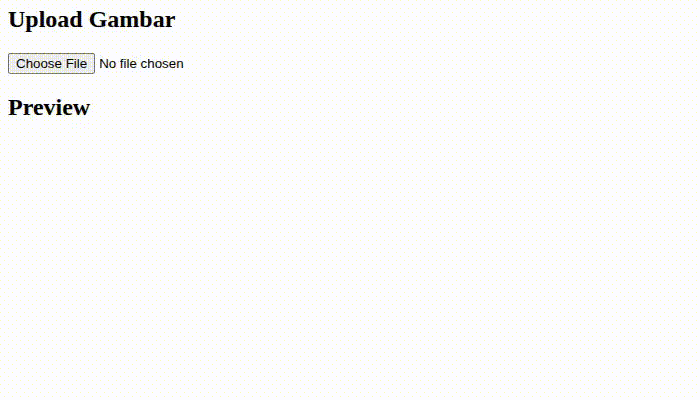

Input file yang menerima gambar sering ditampilkan preview gambarnya sebelum form dikirim.

Sehingga pengguna bisa memastikan gambar yang dipilih sudah benar.

Berikut langkah-langkahnya:

1. Buat element input file gambar.
2. Buat element untuk menampilkan preview gambar.
3. Deteksi event ketika pengguna memilih gambar.
4. Buat url gambar sementara untuk gambar yang dipilih.
5. Tampilkan gambar di element preview gambar.
6. Hapus url dan preview gambar

## 1. Buat Element Input File Gambar

Buat element `input` untuk upload file gambar. Beri atribut `id` supaya lebih mudah diakses.

Beri atribut `accept: image/*` untuk memvalidasi file yang diupload harus gambar.

```html
<h2>Upload Gambar</h2>
<input type="file" id="upload" accept="image/*" />
```

## 2. Buat Element untuk Preview Gambar

Buat element `img` untuk preview gambar. Beri atribut `id` supaya lebih mudah diakses. Tambahkan style `display: none` agar preview tidak muncul di awal.

```html
<h2>Preview</h2>

```

## 3. Deteksi Event Ketika Gambar Dipilih

Tambahkan event `change` pada input file untuk mendeteksi ketika gambar dipilih.

```jsx
document.querySelector('#upload')
  .addEventListener('change', e => {
    // kode
  })
```

## 4. Buat URL Gambar Sementara

Buat url gambar sementara untuk dijadikan `src` pada preview gambar.

Pertama, ambil file gambar yang dipilih pada event files.

```jsx
const file = e.target.files[0]
```

Kemudian buat url sementara dengan `URL.createObjectURL`pada file tersebut.

```jsx
const imageUrl = URL.createObjectURL(file)
```

Masukkan kedua kode tersebut ke dalam event listener sebelumnya.

```jsx
document.querySelector('#upload')
  .addEventListener('change', e => {
    const file = e.target.files[0]
    const imageUrl = URL.createObjectURL(file)
  })
```

## 5. Tampilkan Preview Gambar

Tampilkan gambar dengan menaruh url gambar sementara ke atribut `src` pada elemen preview gambar.

Pertama, ambil elemen preview gambar.

```jsx
const preview = document.querySelector('#preview')
```

Tambahkan url gambar sementara ke atribut `src` dan set style `display` menjadi `block`. Kode ini ditambahkan ke event listener sebelumnya.

```jsx
preview.src = imageUrl
preview.style.display = 'block'
```

Hasil kodenya.

```jsx
const preview = document.querySelector('#preview')

document.querySelector('#upload')
  .addEventListener('change', e => {
    const file = e.target.files[0]
    const imageUrl = URL.createObjectURL(file)

    preview.src = imageUrl
    preview.style.display = 'block'
  })
```

## 6. Hapus URL dan Preview Gambar

Ketika gambar tidak jadi dipilih, maka URL preview gambar perlu dihapus untuk mengosongkan memori dan preview gambar perlu disembunyikan.

Event ketika gambar tidak jadi dipilih dideteksi dari `change` input file, lalu dicek apakah `files` array kosong.

```jsx
const preview = document.querySelector('#preview')

document.querySelector('#upload')
  .addEventListener('change', e => {
    if (e.target.files.length === 0) {
      return
    }
  })
```

Untuk menghapus URL preview gambar, gunakan `URL.revokeObjectURL` . URL preview gambar diambil dari atribut src pada preview gambar.

```jsx
const preview = document.querySelector('#preview')

document.querySelector('#upload')
  .addEventListener('change', e => {
    if (e.target.files.length === 0) {
      URL.revokeObjectURL(preview.src)

      return
    }
  })
```

Untuk menghapus preview gambar, set style `display` jadi `none` dan set atribut `src` menjadi kosong.

```jsx
const preview = document.querySelector('#preview')

document.querySelector('#upload')
  .addEventListener('change', e => {
    if (e.target.files.length === 0) {
      URL.revokeObjectURL(preview.src)

      preview.style.display = 'none'
      preview.src = ''

      return
    }
  })
```

---

Hasil kode untuk preview gambar pada input file:

```html
<h2>Upload Gambar</h2>
<input type="file" id="upload" accept="image/*" />
<br>
<h2>Preview</h2>


<script>
const preview = document.querySelector('#preview')

document.querySelector('#upload')
  .addEventListener('change', e => {
    if (e.target.files.length === 0) {
      URL.revokeObjectURL(preview.src)

      preview.style.display = 'none'
      preview.src = ''

      return
    }

    const file = e.target.files[0]
    const imageUrl = URL.createObjectURL(file)

    preview.src = imageUrl
    preview.style.display = 'block'
  })
</script>
```

Hasilnya ketika dijalankan:


Baca juga [Cara Styling Input File dengan Tailwind CSS](/blog/styling-input-file-tailwind).