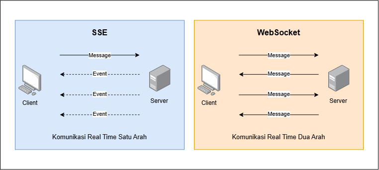
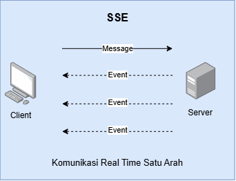
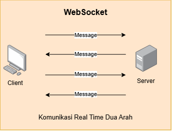

SSE (Server Sent Event) dan WebSocket adalah dua hal yang fungsinya mirip tapi cara kerjanya berbeda.

Keduanya dapat digunakan untuk membuat sistem informasi real time, yaitu client dapat menerima data tanpa perlu terus menerus meminta ke server. Server bisa langsung mengirimkan data ke client.

Contoh penggunaan realnya adalah untuk notifikasi, chat user, live comment, dsb.

Lalu apa bedanya? Jawaban singkat dan sederhananya adalah:

- __SSE__: Client hanya dapat sekali meminta data, selanjutnya hanya server yang dapat mengirimkan data secara terus-menerus.
- __WebSocket__: Client dan server dapat mengirimkan data kapanpun secara terus menerus.

Berikut penjelasan lebih detail:

## SSE (Server Sent Event)

SSE adalah cara untuk mengirimkan data dari server secara terus-menerus tanpa perlu menunggu permintaan dari client. Client hanya sekali meminta data pada awal koneksi ke server.

SSE menggunakan protokol `http`. Jadi, SSE hanyalah HTTP request biasa yang tidak langsung ditutup setelah response pertama, kemudian server bisa mengirimkan beberapa response lagi dari koneksi tersebut secara berkala.

Alur kerja SSE:

1. Client membuka koneksi ke server.
2. Server mengembalikan data ke client.
3. Koneksi tetap terbuka.
4. Server mengirimkan data secara terus-menerus tanpa menunggu client minta.
5. Client menerima setiap data.
6. Server menutup koneksi.

Contoh penggunaan SSE:

1. Import dan export progress.
2. Chat AI, untuk streaming response jawaban dari AI.

Kekurangan SSE:

1. Koneksi satu arah hanya dari server, client tidak bisa mengirim data setelah koneksi.

## WebSocket

WebSocket adalah cara untuk komunikasi dua arah antara client dan server secara langsung tanpa menunggu permintaan dari salah satunya.

WebSocket menggunakan protokol sendiri yaitu `ws` atau `wss`. Meskipun di awal koneksi menggunakan HTTP.

Alur kerja WebSocket:

1. Client menghubungkan ke websocket server.
2. Client dan server saling mengirim data kapan saja selama terhubung.
3. Server atau client menutup koneksi.

Contoh penggunaan WebSocket:

1. Live chat.
2. Live comment.
3. Notifikasi user.

## Mana Yang Lebih Mudah Digunakan?

Keduanya sebenarnya sama-sama mudah diimplementasikan di sisi servernya atau clientnya.

Namun SSE lebih mudah pada beberapa sisi:

1. SSE lebih sederhana karena itu sebenarnya HTTP request biasa.
2. Browser secara otomatis bisa melakukan koneksi ulang ketika koneksi terputus.

## Kapan Menggunakan SSE

1. Notifikasi dan progress pada export dan import data.
2. AI Chat.
3. Status pada job/queue yang berjalan di background.

## Kapan Menggunakan WebSocket

1. Live chat.
2. Live comment.
3. Editor interaktif antar pengguna.
4. Notifikasi User.