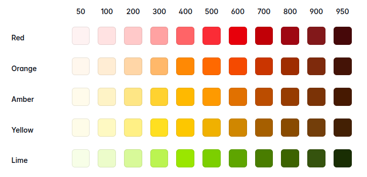
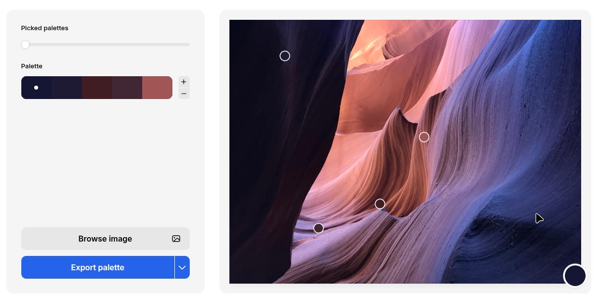
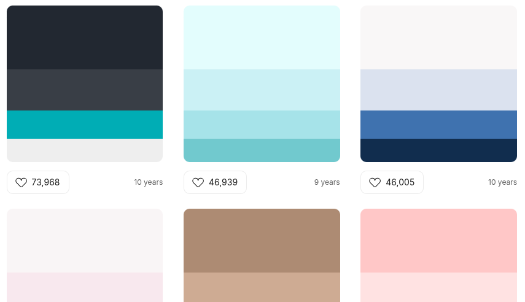
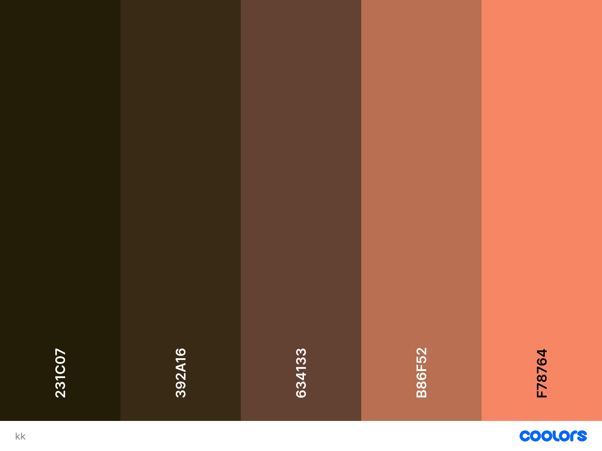

Tailwind menyediakan banyak varian warna yang lengkap dan bisa langsung digunakan.

Namun terkadang, website yang akan kita buat memiliki brand warna spesifik yang tidak terlalu cocok dengan warna bawaan tailwind.

Atau kita ingin menggunakan color pallete sendiri agar website kita tidak terlihat generik (mirip-mirip dengan website lain).

Di artikel ini saya akan membagikan cara membuat color pallete dan menambahkannya ke tailwind.

## Membuat Color Pallete

Kalau Anda sudah punya color pallete, bisa skip langkah ini.

### Membuat Color Pallete dari Gambar



Gunakan tool online berikut untuk membuat color pallete dari gambar:

- [Coolors - Image picker](https://coolors.co/image-picker?ref=620f756bd12557000a8e9289)
- [Adobe - Color palette generator from image](https://color.adobe.com/create/image)

Upload gambar yang diinginkan maka otomatis color pallete akan dihasilkan.

Copy hasil color pallete tersebut.

### Mencari Color Pallete



Kalau tidak mempunyai gambar untuk diambil warnanya, gunakan tool online berikut untuk mencari color pallete yang sudah tersedia.

- [Color Hunt](https://colorhunt.co/)
- [Coolors - Trending Color Palettes](https://coolors.co/palettes/trending?ref=620f756bd12557000a8e9289)

Pilih dan copy color pallete yang paling sesuai dengan website yang akan dibuat.

### Membuat Color Pallete Sendiri



Kalau ingin membuat color pallete sendiri, gunakan tool berikut:

- [Coolors](https://coolors.co?ref=620f756bd12557000a8e9289)
- [Color Space](https://mycolor.space/)
- [Muzli Colors](https://colors.muz.li/)

Untuk menggunakan [Color Space](https://mycolor.space/) dan [Muzli Colors](https://colors.muz.li/), masukkan satu warna utama, tool tersebut akan membuatkan color pallete lengkap sesuai dengan warna utama tersebut.

[Coolors](https://coolors.co?ref=620f756bd12557000a8e9289) juga bagus kalau ingin membuat color pallete satu per satu warnanya.

Copy hasil color pallete yang sudah dibuat.

## Menambahkan Color Pallete ke Tailwind

Buka file css tempat konfigurasi tailwind. Misalnya di `src/style.css`.

- Tambahkan directive `@theme` .
- Tambahkan setiap warna menjadi variabel di dalam `@theme` .
- Setiap warna diberi nama, misalnya `primary`, `secondary` , `accent` , dst.

Syntax variablenya dengan format `--color-{nama}`.

Contoh:

```css
@theme {
	--color-background: #222831;
	--color-secondary: #393E46;
	--color-primary: #00ADB5;
	--color-light: #EEEEEE;
}
```

## Menggunakan Color Pallete

Cara menggunakan color pallete sama seperti menggunakan warna bawaan tailwind, yaitu dengan syntax `utility-color`.

Contoh:

```html
<div class="bg-background p-5">
	<h1 class="text-3xl text-primary font-bold">Primary Title</h1>
	<p class="text-light text-lg">Body Text</p>
</div>
```

Hasilnya:


## Bonus: Membuat Color Shade

Color shade adalah variasi warna yang lebih terang atau lebih gelap.

Banyak manfaatnya, misalnya untuk membuat button dengan warna primary, ketika dihover warnanya menjadi lebih gelap.

Untuk membuat color shade, gunakan tool online berikut:

- [Tailwind Shades Generator](https://tailwindshades.app)
- [UI Colors - Tailwind CSS Color Generator](https://uicolors.app/generate/371674)
- [Coolors - Tailwind Colors](https://coolors.co/tailwind/e59f71?ref=620f756bd12557000a8e9289)

Masukkan warna yang ingin dibuat shade, maka otomatis daftar shade warna akan dihasilkan.

Copy semua shade lalu paste di file css tailwind, setiap shade diberi angka, misal `100-900`  semakin besar semakin gelap.

```css
@theme {
	--color-primary: #00ADB5;
	/* 50 - 500 */
	--color-primary-600: #009CA3;
	/* 700 - 900 */
}
```

Contoh penggunaan shade pada button:

```html
<button class="
	bg-primary
	hover:bg-primary-600
	text-light
	px-4
	py-2
	rounded-md
">
	Button Primary
</button>
```
