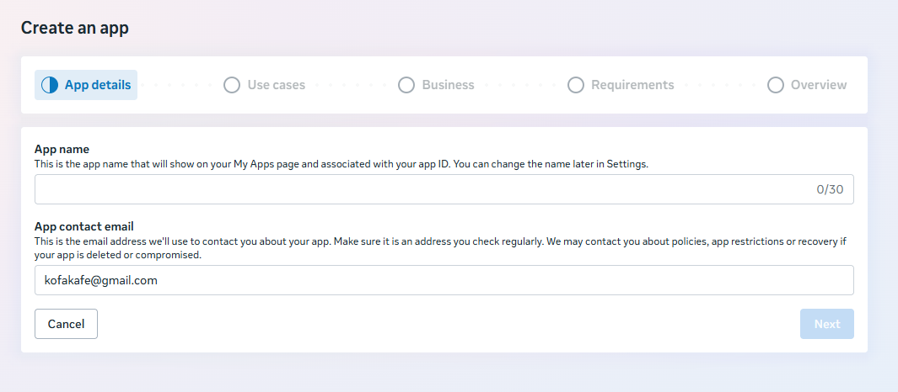
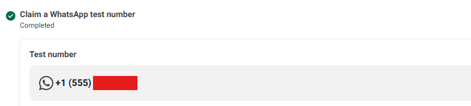
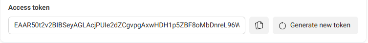
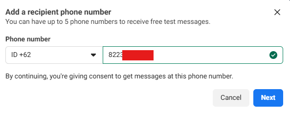

Whatsapp sering digunakan sebagai layanan mengirim pesan dari aplikasi ke user selain menggunakan email dan telegram.

Misalnya untuk marketing, service, autentikasi, dsb.

Whatsapp memiliki API resmi yang bisa digunakan untuk mengirim pesan dari nomor whatsapp yang terhubung ke nomor whatsapp lain.

API resmi ini tentu lebih murah dan lebih stabil daripada menggunakan layanan pihak ketiga.

Sebelum masuk ke tutorial, berikut beberapa hal yang harus diperhatikan untuk menghubungkan nomor whatsapp ke API.

- Nomor whatsapp harus berupa whatsapp bisnis.
- Setelah terhubung, nomor whatsapp tidak dapat diakses di aplikasi mobile, web dan desktop.

Untuk testing, Whatsapp menyediakan nomor whatsapp testing yang dapat digunakan untuk mencoba mengirim pesan ke nomor lain.

## 1. Membuat Meta Developer App



Whatsapp API membutuhkan meta developer app, untuk membuatnya buka di halaman [Meta Developers](https://developers.facebook.com/apps/). 

- Klik tombol `Create App`.
- Di bagian App details, isi nama aplikasi dan kontak email.
- Di bagian Use cases, centang Business Messaging > Connect with customers through Whatsapp.
- Di bagian Business, pilih bisnis portofolio yang ada, halaman facebook dapat dipilih atau buat bisnis portofolio baru.
- Simpan dengan klik tombol `Create App`.

Setelah tersimpan, halaman akan diarahkan ke dashboard meta developer app.

## 2. Membuat Nomor Whatsapp Testing



Nomor whatsapp testing dapat diklaim gratis untuk mengirim pesan ke nomor whatsapp lain. Berikut caranya:

- Buka menu `Use cases` di sidebar dashboard.
- Klik tombol `Customize` di card “Connect with customers through Whatsapp.”
- Klik tombol `Continue` untuk mengaktifkan whatsapp.
- Buka menu `Basic Setup > Step 1. Try it out` maka secara otomatis nomor whatsapp testing sudah terbuat dan bisa digunakan.
- Salin nomor whatsapp tersebut, Phone Number ID, dan WhatsApp Business account ID untuk mengirim pesan ke nomor whatsapp lain.

## 3. Membuat API Token



Masih di bagian nomor whatsapp testing, buat API token untuk bisa menggunakan API whatsapp.

- Klik tombol `Generate Token` di sekitar nomor whatsapp testing.
- Ikuti semua langkah-langkahnya.
- Setelah selesai akan muncul token di input akses token. Salin token tersebut untuk menggunakan API whatsapp di langkah selanjutnya.

## 4. Menambahkan Nomor Telepon Penerima



Nomor telepon penerima harus ditambahkan dan diverifikasi jika ingin mengirim pesan ke nomor tersebut melalui nomor whatsapp testing.

- Klik dropdown `Recipient` di bagian Send a message from your test number.
- Klik `Manage phone number list`.
- Masukkan nomor telepon penerima.
- Whatsapp akan mengirim kode verifikasi ke nomor telepon penerima.
- Masukkan kode verifikasi dan simpan.

Jika nanti sudah menggunakan nomor whatsapp bisnis maka langkah ini tidak perlu dilakukan.

## 5. Menginstal Package Whatsapp API Laravel

Untuk menggunakan whatsapp API di laravel, gunakan package [whatsapp-cloud-api](https://github.com/netflie/whatsapp-cloud-api).

Instal menggunakan composer:

```bash
composer require netflie/whatsapp-cloud-api
```

Buat service provider untuk package tersbut:

```bash
php artisan make:provider WhatsAppServiceProvider
```

Isinya seperti berikut:

```php
<?php

namespace App\Providers;

use Illuminate\Support\ServiceProvider;
use Netflie\WhatsAppCloudApi\WhatsAppCloudApi;

class WhatsAppServiceProvider extends ServiceProvider
{
    /**
     * Register services.
     */
    public function register(): void
    {
        $config = [
            'from_phone_number_id' => $this->app->make('config')->get('services.whatsapp.from_phone_number_id'),
            'access_token' => $this->app->make('config')->get('services.whatsapp.token')
        ];

        $this->app->bind(WhatsAppCloudApi::class, static fn () => new WhatsAppCloudApi($config));
    }
}
```

Buat konfigurasi whatsapp di file `config.services.php`. Tambahkan key `whatsapp` dengan isi berikut:

```php
<?php

return [
	// konfigurasi lain
	'whatsapp' => [
		'from_phone_number_id' => env('WHATSAPP_FROM_PHONE_NUMBER_ID'),
		'token' => env('WHATSAPP_TOKEN'),
  	]
];
```

Terakhir, tambahkan whatsapp phone number id dan token yang sudah didapatkan sebelumnya ke `.env` seperti berikut:

```php
WHATSAPP_FROM_PHONE_NUMBER_ID=
WHATSAPP_TOKEN=
```

Whatsapp API siap dipakai di langkah berikutnya.

## 6. Mengirim Pesan ke Nomor Whatsapp

Jenis pesan yang dapat dikirim ke nomor whatsapp melalui package `WhatsAppCloudApi` ada banyak, seperti:

1. Pesan teks.
2. Pesan template.
3. Pesan gambar.
4. Dsb.

### Contoh Mengirim Pesan Teks

Untuk mengirim pesan teks ke nomor whatsapp, gunakan method `sendTextMessage`. 

- Parameter pertama diisi nomor hp penerima.
- Parameter kedua diisi pesan teksnya.

Contoh:

```php
<?php

use Netflie\WhatsAppCloudApi\WhatsAppCloudApi;

WhatsAppCloudApi::sendTextMessage('628xxxxx', 'Hai bro');
```

Untuk menghandle error ketika mengirim pesan, gunakan `try catch` , ambil `ResponseException` bawaan package.

```php
<?php

use Netflie\WhatsAppCloudApi\WhatsAppCloudApi;
use Netflie\WhatsAppCloudApi\Response\ResponseException;

try {
	WhatsAppCloudApi::sendTextMessage('628xxxxx', 'Hai bro');
} catch (ResponseException $e) {
	dd($e->response());
}
```

Contoh di dalam controller:

```php
<?php

namespace App\Http\Controllers;

use Illuminate\Http\Request;
use Netflie\WhatsAppCloudApi\WhatsAppCloudApi;
use Netflie\WhatsAppCloudApi\Response\ResponseException;

class MessageController
{
	public function sendWaMessage(Request $request)
	{
		$request->validate([
			'phone' => ['required', 'numeric', 'digits_between:13,12'],
			'message' => ['required', 'string', 'digits_between:1,255']
		]);
		
		$phone = $request->input('phone');
		$message= $request->input('message');
		
		try {
			WhatsAppCloudApi::sendTextMessage($phone, $message);
			
			return response()->json(['sent' => true, 'error' => null]);
		} catch (ResponseException $e) {
			return response()->json(['sent' => false, 'error' => $e->response()]);
		}
	}
}
```

Karena mengirim pesan ke nomor whatsapp membutuhkan waktu yang cukup lama, biasanya saya memasukkanya ke dalam queue job. Contoh:

```php
<?php

namespace App\Http\Controllers;

use Illuminate\Http\Request;
use App\Jobs\SendWhatsappText;

class MessageController
{
	public function sendWaMessage(Request $request)
	{
		$request->validate([
			'phone' => ['required', 'numeric', 'digits_between:13,12'],
			'message' => ['required', 'string', 'digits_between:1,255']
		]);
		
		$phone = $request->input('phone');
		$message= $request->input('message');
		
		SendWhatsappText::dispatch($phone, $message);
	}
}
```

```php
<?php

namespace App\Jobs;

use Netflie\WhatsAppCloudApi\WhatsAppCloudApi;
use Netflie\WhatsAppCloudApi\Response\ResponseException;

class SendWhatsappText
{
	public function __construct(public string $phome, public string $message) {}
	
	public function handle()
	{
		try {
			WhatsAppCloudApi::sendTextMessage($this->phone, $this->message);
		} catch (ResponseException $e) {
			// handle error
		}
	}
}
```

## Selanjutnya

Di artikel selanjutnya, akan dibahas cara menggunakan nomor whatsapp bisnis untuk mengirim ke nomor whatsapp lain.